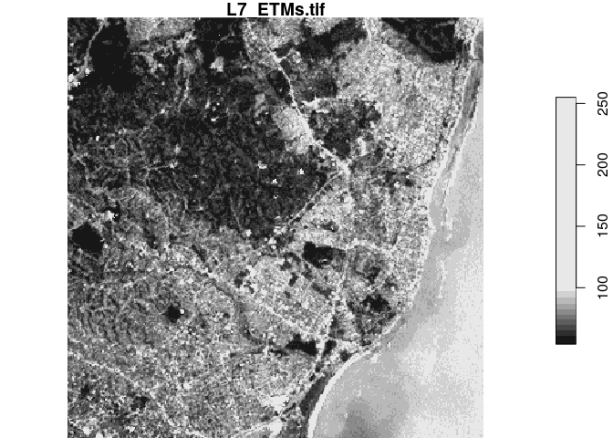
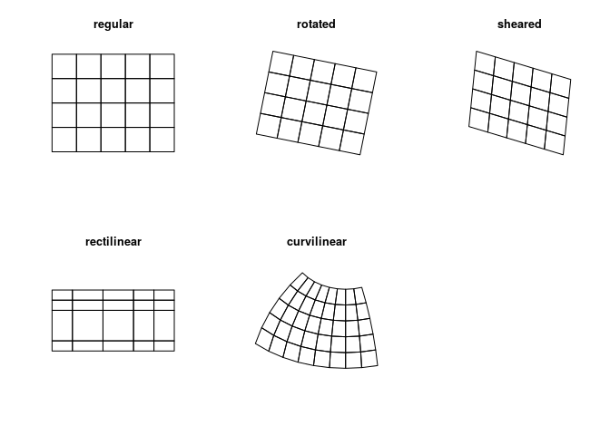

<!-- README.md is generated from README.Rmd. Please edit that file - rmarkdown::render('README.Rmd', output_format = 'github_document', output_file = 'README.md') -->
Spatiotemporal Arrays: Raster and Vector Datacubes
==================================================

[](https://travis-ci.org/r-spatial/stars) [](https://ci.appveyor.com/project/edzerpebesma/stars) [](https://codecov.io/gh/r-spatial/stars) [](https://cran.r-project.org/package=stars) [](https://cran.r-project.org/web/checks/check_results_stars.html) [](http://www.r-pkg.org/pkg/stars)

Spatiotemporal data often comes in the form of dense arrays, with space and time being array dimensions. Examples include

-   socio-economic or demographic data,
-   environmental variables monitored at fixed stations,
-   raster maps
-   time series of satellite images with multiple spectral bands,
-   spatial simulations, and
-   climate or weather model output.

This R package provides classes and methods for reading, manipulating, plotting and writing such data cubes, to the extent that there are proper formats for doing so.

Raster and vector data cubes
----------------------------

The canonical data cube most of us have in mind is that where two dimensions represent spatial raster dimensions, and the third time (or band), as e.g. shown here:


By data cubes however we also consider higher-dimensional cubes (hypercubes) such as a five-dimensional cube where in addition to time, spectral band and sensor form dimensions:


or lower-dimensional cubes such as a raster image:

``` r
suppressPackageStartupMessages(library(tidyverse))
library(stars)
# Loading required package: abind
# Loading required package: sf
# Linking to GEOS 3.7.0, GDAL 2.4.0, PROJ 5.2.0
tif = system.file("tif/L7_ETMs.tif", package = "stars")
read_stars(tif) %>%
  slice(prec, index = 1, along = "band") %>%
  plot()
```



Raster data do not need to be regular and aligned with North/East, and package `stars` supports besides *regular* also *rotated*, *sheared*, *rectilinear* and *curvilinear* rasters:

``` r
x = 1:5
y = 1:4
d = st_dimensions(x = x, y = y, .raster = c("x", "y"))
m = matrix(runif(20),5,4)
r1 = st_as_stars(r = m, dimensions = d)

r = attr(d, "raster")
r$affine = c(0.2, -0.2)
attr(d, "raster") = r
r2 = st_as_stars(r = m, dimensions = d)

r = attr(d, "raster")
r$affine = c(0.1, -0.3)
attr(d, "raster") = r
r3 = st_as_stars(r = m, dimensions = d)

x = c(1, 2, 3.5, 5, 6)
y = c(1, 1.5, 3, 3.5)
d = st_dimensions(x = x, y = y, .raster = c("x", "y"))
r4 = st_as_stars(r = m, dimensions = d)

grd = st_make_grid(cellsize = c(10,10), offset = c(-130,10), n= c(8,5), crs=st_crs(4326))
r5 = st_transform(grd, "+proj=laea +lon_0=-70 +lat_0=35")

par(mfrow = c(2,3))
r1 = st_make_grid(cellsize = c(1,1), n = c(5,4), offset = c(0,0))
plot(r1, main = "regular")
plot(st_geometry(st_as_sf(r2)), main = "rotated")
plot(st_geometry(st_as_sf(r3)), main = "sheared")
plot(st_geometry(st_as_sf(r4, as_points = FALSE)), main = "rectilinear")
plot(st_geometry((r5)), main = "curvilinear")
```



Vector data cubes arise when we do not have two regularly discretized spatial dimensions, but a single dimension indicating spatial feature geometries, such as polygons (e.g. denoting administrative regions):


or points (e.g. denoting sensor locations):


The [`gdalcubes`](https://github.com/appelmar/gdalcubes_R/) package
-------------------------------------------------------------------

Package `gdalcubes` can be used to create data cubes (or functions from them) from image collections, sets of multi-band images with different

-   spatial resolution
-   spatial extent
-   coordinate reference systems (e.g., spread over multiple UTM zones)
-   observation times

and does this by resampling and/or aggregating over space and/or time; it heavily reuses GDAL VRT's and gdalwarp for spatial resampling and/or warping.

The [`raster`](https://github.com/rspatial/raster/) package
-----------------------------------------------------------

Package `raster` is a powerful package for handling raster maps and stacks of raster maps both in memory and on disk, but does not address

-   non-raster time series,
-   rasters time series with multiple attributes,
-   rasters with mixed type attributes (e.g., numeric, logical and factor)
-   rectilinear or curvilinear rasters

A list of `stars` commands matching existing `raster` commands is found in this [wiki](https://github.com/r-spatial/stars/wiki/How-%60raster%60-functions-map-to-%60stars%60-functions). A list of translations in the opposite direction (from `stars` to `raster`) still needs to be made.

Other `stars` resources:
------------------------

-   blog posts: [first](http://r-spatial.org/r/2017/11/23/stars1.html), [second](https://www.r-spatial.org/r/2018/03/22/stars2.html), [third](https://www.r-spatial.org/r/2018/03/23/stars3.html)
-   vignettes: [first](https://r-spatial.github.io/stars/articles/stars1.html), [second](https://r-spatial.github.io/stars/articles/stars2.html), [third](https://r-spatial.github.io/stars/articles/stars3.html), [fourth](https://r-spatial.github.io/stars/articles/stars4.html), [fifth](https://r-spatial.github.io/stars/articles/stars5.html)
-   the original [R Consortium proposal](https://github.com/edzer/stars/blob/master/PROPOSAL.md).

### Acknowledgment

This project has been realized with financial [support](https://www.r-consortium.org/blog/2017/04/03/q1-2017-isc-grants) from the

<a href="https://www.r-consortium.org/projects/awarded-projects">  </a>
