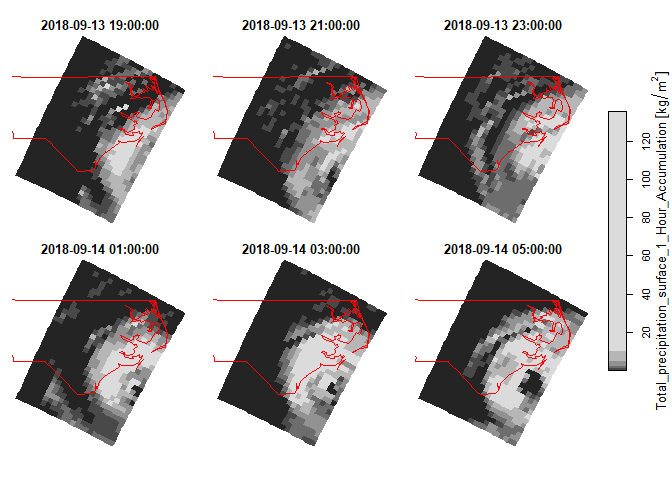
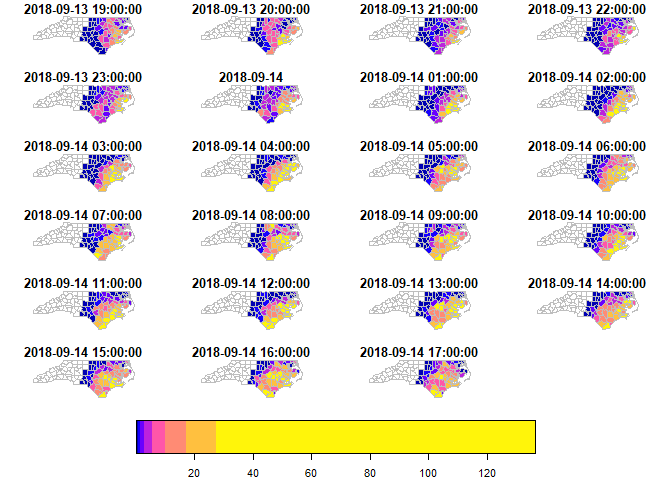
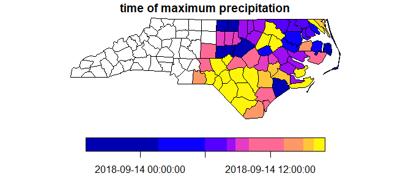

# Spatiotemporal Arrays: Raster and Vector Datacubes

<!-- badges: start -->

[](https://github.com/r-spatial/stars/actions)
[](https://cran.r-project.org/package=stars)
[](https://cran.r-project.org/web/checks/check_results_stars.html)
[](https://www.r-pkg.org/pkg/stars)
[](https://CRAN.R-project.org/package=stars)
<!--
[](https://app.codecov.io/gh/r-spatial/stars?branch=main)
--> <!-- badges: end -->

Spatiotemporal data often comes in the form of dense arrays, with space
and time being array dimensions. Examples include

-   socio-economic or demographic data,
-   environmental variables monitored at fixed stations,
-   raster maps
-   time series of satellite images with multiple spectral bands,
-   spatial simulations, and
-   climate or weather model output.

This R package provides classes and methods for reading, manipulating,
plotting and writing such data cubes, to the extent that there are
proper formats for doing so.

## Raster and vector data cubes

The canonical data cube most of us have in mind is that where two
dimensions represent spatial raster dimensions, and the third time (or
band), as e.g. shown here:


By data cubes however we also consider higher-dimensional cubes
(hypercubes) such as a five-dimensional cube where in addition to time,
spectral band and sensor form dimensions:


or lower-dimensional cubes such as a raster image:

``` r
suppressPackageStartupMessages(library(dplyr))
library(stars)
# Loading required package: abind
# Loading required package: sf
# Linking to GEOS 3.10.2, GDAL 3.4.3, PROJ 8.2.1; sf_use_s2() is TRUE
tif = system.file("tif/L7_ETMs.tif", package = "stars")
read_stars(tif) %>%
  slice(index = 1, along = "band") %>%
  plot()
```

<!-- -->

Raster data do not need to be regular and aligned with North/East, and
package `stars` supports besides *regular* also *rotated*, *sheared*,
*rectilinear* and *curvilinear* rasters:

<!-- -->

Vector data cubes arise when we do not have two regularly discretized
spatial dimensions, but a single dimension that points to distinct
spatial feature geometries, such as polygons (e.g. denoting
administrative regions):


or points (e.g. denoting sensor locations):


NetCDF’s CF-convention calls this a [discrete
axis](https://cfconventions.org/Data/cf-conventions/cf-conventions-1.8/cf-conventions.html#discrete-axis).

## NetCDF, GDAL

`stars` provides two functions to read data: `read_ncdf` and
`read_stars`, where the latter reads through GDAL. (In the future, both
will be integrated in `read_stars`.) For reading NetCDF files, package
`RNetCDF` is used, for reading through GDAL, package `sf` provides the
binary linking to GDAL.

For vector and raster operations, `stars` uses as much as possible the
routines available in GDAL and PROJ (e.g. `st_transform`, `rasterize`,
`polygonize`, `warp`). Read more about this in the vignette on
[vector-raster conversions, reprojection,
warping](https://r-spatial.github.io/stars/articles/stars5.html).

## Out-of-memory (on-disk) rasters

Package `stars` provides `stars_proxy` objects (currently only when read
through GDAL), which contain only the dimensions metadata and pointers
to the files on disk. These objects work lazily: reading and processing
data is postponed to the moment that pixels are really needed (at plot
time, or when writing to disk), and is done at the lowest spatial
resolution possible that still fulfills the resolution of the graphics
device. More details are found in the [stars proxy
vignette](https://r-spatial.github.io/stars/articles/stars2.html).

The following methods are currently available for `stars_proxy` objects:

``` r
methods(class = "stars_proxy")
#  [1] [               [[<-            [<-             adrop          
#  [5] aggregate       aperm           as.data.frame   c              
#  [9] coerce          dim             droplevels      filter         
# [13] hist            initialize      is.na           Math           
# [17] merge           mutate          Ops             plot           
# [21] predict         print           pull            rename         
# [25] select          show            slice           slotsFromS3    
# [29] split           st_apply        st_as_sf        st_as_stars    
# [33] st_crop         st_dimensions<- st_downsample   st_mosaic      
# [37] st_redimension  st_sample       st_set_bbox     transmute      
# [41] write_stars    
# see '?methods' for accessing help and source code
```

## Raster and vector time series analysis example

In the following, a curvilinear grid with hourly precipitation values of
a hurricane is imported and the first 12 time steps are plotted:

``` r
prec_file = system.file("nc/test_stageiv_xyt.nc", package = "stars")
(prec = read_stars(gdal_subdatasets(prec_file)[[1]]))
# stars object with 3 dimensions and 1 attribute
# attribute(s):
#                                            Min. 1st Qu. Median     Mean 3rd Qu.
# Total_precipitation_surface_1_... [kg/m^2]    0       0   0.75 4.143009    4.63
#                                              Max.
# Total_precipitation_surface_1_... [kg/m^2] 163.75
# dimension(s):
#      from  to                  offset   delta  refsys
# x       1  87                      NA      NA  WGS 84
# y       1 118                      NA      NA  WGS 84
# time    1  23 2018-09-13 19:00:00 UTC 1 hours POSIXct
#                                      values x/y
# x    [87x118] -80.6113 [°],...,-74.8822 [°] [x]
# y      [87x118] 32.4413 [°],...,37.6193 [°] [y]
# time                                   NULL    
# curvilinear grid
# or: (prec = read_ncdf(prec_file, curvilinear = c("lon", "lat"), ignore_bounds = TRUE))
sf::read_sf(system.file("gpkg/nc.gpkg", package = "sf"), "nc.gpkg") %>%
  st_transform(st_crs(prec)) -> nc # transform from NAD27 to WGS84
nc_outline = st_union(st_geometry(nc))
plot_hook = function() plot(nc_outline, border = 'red', add = TRUE)
prec %>%
  slice(index = 1:12, along = "time") %>%
  plot(downsample = c(3, 3, 1), hook = plot_hook)
```

<!-- -->

and next, intersected with with the counties of North Carolina, where
the maximum precipitation intensity was obtained per county, and
plotted:

``` r
a = aggregate(prec, by = nc, FUN = max)
plot(a, max.plot = 23, border = 'grey', lwd = .5)
```

<!-- -->

We can integrate over (reduce) time, for instance to find out *when* the
maximum precipitation occurred. The following code finds the time index,
and then the corresponding time value:

``` r
index_max = function(x) ifelse(all(is.na(x)), NA, which.max(x))
st_apply(a, "geom", index_max) %>%
  mutate(when = st_get_dimension_values(a, "time")[.$index_max]) %>%
  select(when) %>%
  plot(key.pos = 1, main = "time of maximum precipitation")
```

<!-- -->

## Other packages for data cubes

### [`gdalcubes`](https://github.com/appelmar/gdalcubes_R/)

Package `gdalcubes` can be used to create data cubes (or functions from
them) from image collections, sets of multi-band images with varying

-   spatial resolution
-   spatial extent
-   coordinate reference systems (e.g., spread over multiple UTM zones)
-   observation times

and does this by resampling and/or aggregating over space and/or time.
It reuses GDAL VRT’s and gdalwarp for spatial resampling and/or warping,
and handles temporal resampling or aggregation itself.

### [`ncdfgeom`](https://github.com/USGS-R/ncdfgeom)

`ncdfgeom` reads and writes vector data cubes from and to netcdf files
in a standards-compliant way.

### [`raster`](https://github.com/rspatial/raster/)

Package `raster` is a powerful package for handling raster maps and
stacks of raster maps both in memory and on disk, but does not address

-   non-raster time series,
-   multi-attribute rasters time series
-   rasters with mixed type attributes (e.g., numeric, logical, factor,
    POSIXct)
-   rectilinear or curvilinear rasters

A list of `stars` commands matching existing `raster` commands is found
in this
[wiki](https://github.com/r-spatial/stars/wiki/How-%60raster%60-functions-map-to-%60stars%60-functions).
A list of translations in the opposite direction (from `stars` to
`raster`) still needs to be made.

## Other `stars` resources:

-   blog posts: [first](https://r-spatial.org/r/2017/11/23/stars1.html),
    [second](https://www.r-spatial.org/r/2018/03/22/stars2.html),
    [third](https://www.r-spatial.org/r/2018/03/23/stars3.html)
-   vignettes:
    [first](https://r-spatial.github.io/stars/articles/stars1.html),
    [second](https://r-spatial.github.io/stars/articles/stars2.html),
    [third](https://r-spatial.github.io/stars/articles/stars3.html),
    [fourth](https://r-spatial.github.io/stars/articles/stars4.html),
    [fifth](https://r-spatial.github.io/stars/articles/stars5.html)
-   the original [R Consortium
    proposal](https://github.com/edzer/stars/blob/master/PROPOSAL.md).

### Acknowledgment

This project has been realized with financial
[support](https://www.r-consortium.org/blog/2017/04/03/q1-2017-isc-grants)
from the

<a href="https://www.r-consortium.org/all-projects/awarded-projects/2017-group-1">

</a>
